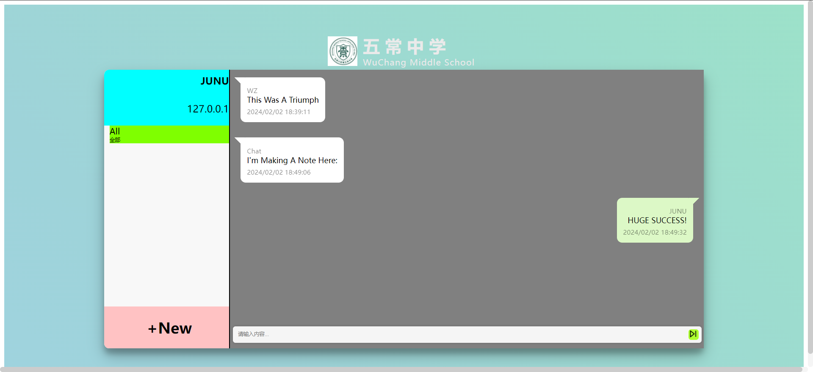

# WZChat
简易聊天网站，以ip为标识符

# 哀悼
于 2024/1/26 23:00:00 时，因 PyCharm 向 GitHub 提交时操作错误，致使之前几乎完成的代码全部丢失，经多方尝试尝试寻找备份无果（这使我几乎精神崩溃）

# 喜报！
于 2024/1/27 13:30:00 时，使用数据恢复软件召唤破烂 PyCharm 删除的文件（喜）

# happy
于 2024/1/31 22:30:00-23:30:00 时，写了一个消失代码改一个BUG，解决JS的同步异步函数接口问题，**coding从未如此快乐**

# 莫大的成功！
于 2024/2/1 22:27:10 时，使用WZChat发出第一条消息 "你好！" ，并**成功接收**！WZChat获得伟大胜利！

于 2024/2/2 18:16:45 时，使用WZChat发出第一条公共聊天室消息 "这里是五常中学！" 被**成功保存**，但被前端显示为"这里是五常中学！127.0.0.1"，于 18:24:40 修复前端问题

于 2024/2/2 18:30:45 时，WZChat 成功发出完成后第一条消息 "Hello!WZ"

# 纪念

---

